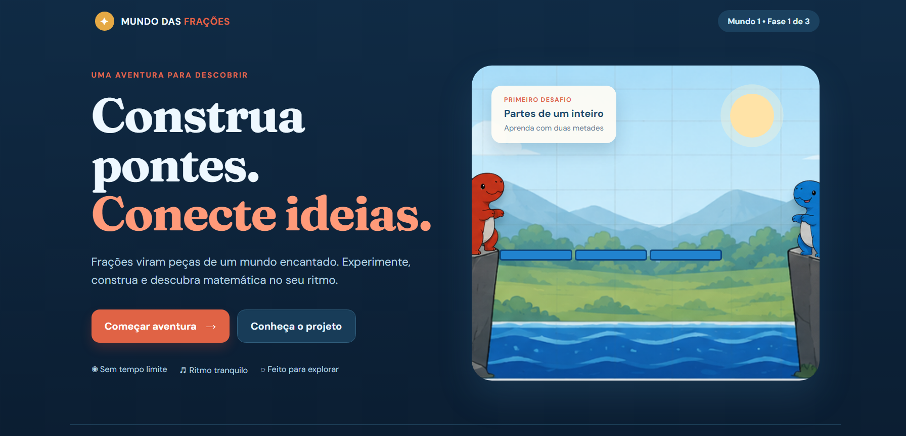
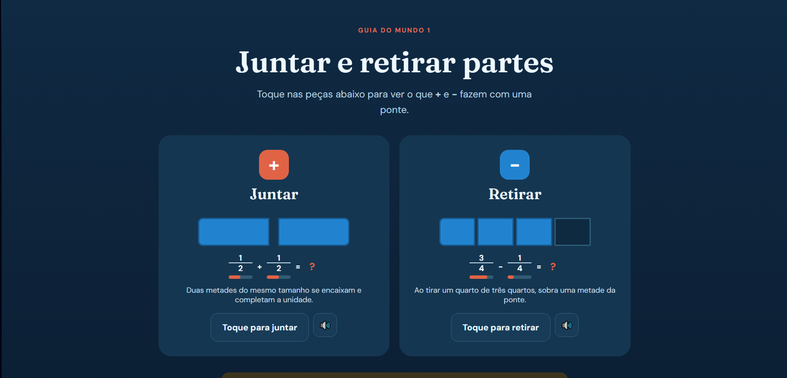
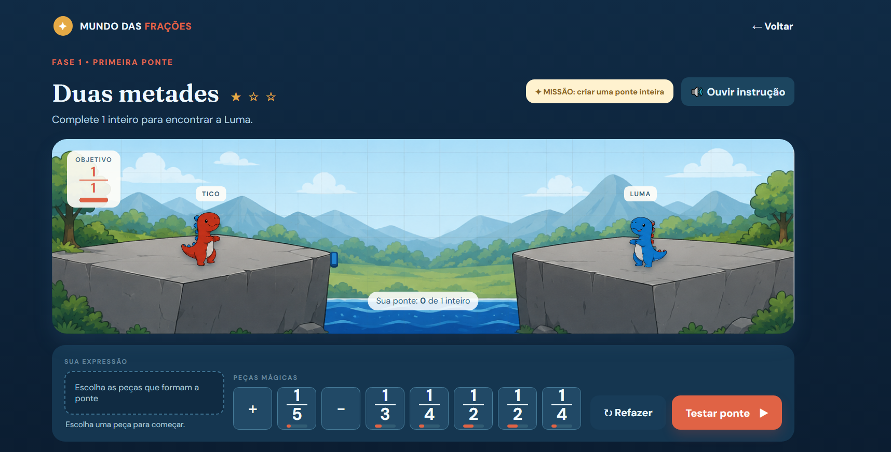
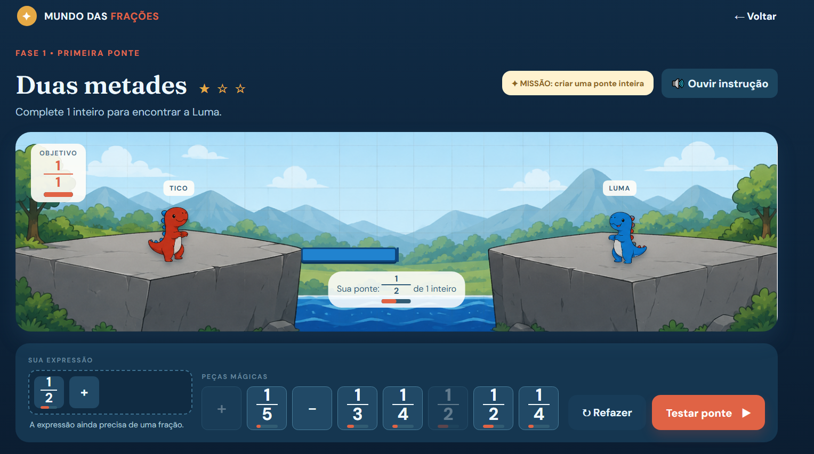

# Mundo das Frações

**Um jogo educativo 2D para aprendizagem introdutória de frações, com ênfase em acessibilidade para pessoas autistas.**


---

## Resumo

_Mundo das Frações_ é um jogo educativo baseado em navegador cuja hipótese central é que **representar frações como objetos espaciais manipuláveis, e fazer com que operações matemáticas tenham consequências visíveis no mundo do jogo, pode reduzir a distância entre a compreensão concreta e a representação simbólica de frações**. O jogador controla dois personagens, Tico e Luma, separados por abismos que só podem ser cruzados construindo pontes a partir de cartas de frações e operações. Uma ponte só é atravessável quando a expressão matemática associada a ela é correta.

O projeto é desenvolvido como um artefato de pesquisa em tecnologia educacional, com atenção explícita a critérios de acessibilidade (ritmo ajustável, ausência de pressão de tempo, suporte a texto-para-fala, feedback não punitivo) e à separação entre lógica matemática e apresentação visual, de modo a permitir validação e, futuramente, avaliação experimental com estudantes.

Esta hipótese de design é tratada como uma proposição a ser investigada, não como um fato comprovado, e deve ser avaliada empiricamente antes de qualquer generalização sobre sua eficácia pedagógica.

---

## Sumário

1. [Motivação e fundamentação pedagógica](#motivação-e-fundamentação-pedagógica)
2. [Mecânica do jogo](#mecânica-do-jogo)
3. [Capturas de tela](#capturas-de-tela)
4. [Progressão pedagógica](#progressão-pedagógica)
5. [Acessibilidade](#acessibilidade)
6. [Arquitetura técnica](#arquitetura-técnica)
7. [Estado atual de desenvolvimento](#estado-atual-de-desenvolvimento)
8. [Estrutura do repositório](#estrutura-do-repositório)
9. [Instalação e execução](#instalação-e-execução)
10. [Testes](#testes)
11. [Roadmap](#roadmap)
12. [Métricas e possibilidades de pesquisa](#métricas-e-possibilidades-de-pesquisa)
13. [Referências conceituais](#referências-conceituais)
14. [Como contribuir](#como-contribuir)
15. [Licença](#licença)

---

## Motivação e fundamentação pedagógica

O ensino de frações é reconhecido na literatura de educação matemática como um dos pontos de maior dificuldade na transição do pensamento aritmético concreto para o pensamento proporcional e algébrico. Abordagens centradas exclusivamente em notação simbólica (`a/b`) tendem a dissociar o conceito de fração de sua referência intuitiva como _parte de um todo_, especialmente para estudantes neurodivergentes que se beneficiam de representações visuais, previsíveis e multimodais.

_Mundo das Frações_ parte do princípio de que a matemática deve ser **uma propriedade do mundo do jogo**, e não uma sequência de exercícios disfarçados de mecânica lúdica:

- frações correspondem a pedaços físicos de uma ponte;
- operações combinam, alteram ou transformam esses pedaços;
- uma expressão correta produz uma ponte funcional e atravessável;
- uma expressão incorreta produz feedback visual interpretável, não punitivo;
- novas relações matemáticas (como a soma de frações com denominadores diferentes) são **descobertas pela experimentação do jogador** antes de receberem uma explicação formal.

Essa filosofia de design é inspirada — sem reprodução de conteúdo, arte ou identidade visual — em jogos como _DragonBox_, _Beltmatic_, _The Farmer Was Replaced_, _Human Resource Machine_ e _Poly Bridge_, nos quais conceitos abstratos se tornam ferramentas necessárias para resolver problemas do mundo, e não respostas a perguntas explícitas.

---

## Mecânica do jogo

O jogador recebe um conjunto de **cartas** (frações, operações e cartas especiais) e deve combiná-las para formar uma expressão cujo valor corresponda ao comprimento necessário de uma ponte entre dois penhascos. Ao pressionar **Testar ponte**, o personagem tenta atravessar; se a expressão for matematicamente correta, a travessia é bem-sucedida.

Loop principal de uma fase:

1. apresentação do objetivo (ex.: completar `1` inteiro);
2. apresentação das cartas disponíveis (o "balastro" da fase);
3. o jogador seleciona/arrasta cartas para montar uma expressão;
4. a expressão determina visualmente a composição parcial da ponte;
5. o jogador pode **Refazer** a qualquer momento, sem penalidade;
6. o jogador pressiona **Testar ponte**;
7. o personagem tenta a travessia;
8. em caso de sucesso, a travessia se completa e uma explicação/descoberta pode ser exibida;
9. o progresso é registrado e o jogador avança.

A eficiência da solução (número de cartas usadas em relação ao mínimo necessário) é avaliada separadamente da correção matemática, e **nunca é usada para punir o jogador** — apenas para oferecer um indicador opcional de domínio do conceito. O jogo não utiliza contagem regressiva nem qualquer forma de pressão temporal como requisito central.

---

## Capturas de tela

As imagens abaixo ilustram o protótipo de interface do Mundo 1 ("Partes de um inteiro"), incluindo a tela inicial, o guia introdutório de operações e a fase "Duas metades", em diferentes estados de progresso.

### Tela inicial



A tela de abertura apresenta a proposta do projeto ("Construa pontes. Conecte ideias.") e uma pré-visualização do cenário do Mundo 1, com os personagens Tico e Luma em lados opostos de uma ponte incompleta.

### Guia introdutório do Mundo 1



Antes da primeira fase, um painel interativo apresenta as operações de **Juntar** (adição) e **Retirar** (subtração) de frações com denominadores iguais, usando representação visual de blocos ao lado da notação simbólica.

### Fase "Duas metades" — estado inicial



O objetivo da fase (`1/1`) é exibido junto ao cenário. A ponte começa vazia ("Sua ponte: 0 de 1 inteiro") e o jogador dispõe de cartas de frações (`1/5`, `1/3`, `1/4`, `1/2`, `1/2`, `1/4`) e do operador `+`.

### Fase "Duas metades" — em progresso



Após o jogador posicionar a carta `1/2` e o operador `+`, a ponte reflete visualmente a fração acumulada (`1/2` de `1` inteiro), e a interface indica que a expressão ainda precisa de uma fração adicional para ser avaliada.

---

## Progressão pedagógica

O conteúdo é organizado em mundos, do concreto para o abstrato:

| Mundo | Conceito                            | Exemplo             |
| ----- | ----------------------------------- | ------------------- |
| 1     | Partes de um inteiro                | `1/2`, `1/3`, `1/4` |
| 2     | Frações equivalentes                | `1/2 = 2/4 = 3/6`   |
| 3     | Adição com denominadores iguais     | `1/2 + 1/2 = 1`     |
| 4     | Adição com denominadores diferentes | `1/2 + 1/3 = 5/6`   |
| 5     | Outras operações                    | `+`, `−`, `×`, `÷`  |
| 6     | Razão e proporção                   | `a/b = c/d`         |

No Mundo 4, é introduzida a técnica mnemônica popularmente chamada de "borboleta" (`a/b + c/d = (ad + bc)/bd`), explicitamente apresentada ao jogador como um **recurso visual auxiliar**, e não como uma propriedade matemática fundamental — decisão de design registrada como regra obrigatória para o time de desenvolvimento (ver [Regras para o agente de desenvolvimento](#como-contribuir)).

Extensões futuras possíveis, condicionadas à validação do núcleo do jogo, incluem porcentagem, razão, proporção, regra de três, números mistos, comparação de frações e problemas geométricos.

---

## Acessibilidade

A acessibilidade é tratada como parte do design central do projeto, não como um recurso adicionado posteriormente. Diretrizes atuais:

- **Texto-para-fala (TTS):** narração de objetivos, cartas, instruções, explicações, resultados e dicas, via Web Speech API, encapsulada em um serviço substituível.
- **Controle de estímulos:** intensidade configurável (ou desativação total) de animações, sons e movimento.
- **Design visual:** alto contraste, fontes legíveis, textos curtos, elementos bem separados, uso de ícones acompanhados de texto, ausência de flashes e de excesso de partículas, e nenhuma informação transmitida exclusivamente por cor.
- **Ritmo:** ausência de tempo limite; o jogador pode pensar, repetir, desfazer e ouvir explicações novamente sem penalidade.
- **Feedback não agressivo:** mensagens de erro descritivas e neutras (ex.: _"A ponte ainda não alcança o outro lado"_), em vez de indicadores punitivos de erro/acerto.

---

## Arquitetura técnica

### Stack alvo (especificação de design)

- **TypeScript**
- **Phaser 3**
- **Vite**
- HTML5 / CSS3
- Web Speech API (TTS)
- `localStorage` para persistência local de progresso

### Princípio arquitetural

A lógica matemática deve ser independente da camada de renderização, seguindo o fluxo:

```
Matemática → Estado do jogo → Renderização / interação → Acessibilidade / áudio
```

Essa separação permite testar a corretude matemática sem executar o jogo, e é tratada como restrição de arquitetura não negociável (ver regra 2 em [Regras para o agente de desenvolvimento](#como-contribuir)).

### Sistema matemático

O núcleo do jogo depende de uma estrutura `Fraction` com, no mínimo, as operações `add`, `subtract`, `multiply`, `divide`, `simplify`, `equals`, `compare`, `toNumber` e `toString`, com as seguintes garantias:

- denominador nunca pode ser zero;
- sinais são normalizados;
- frações são simplificadas por MDC (máximo divisor comum);
- comparações de igualdade evitam depender de aritmética de ponto flutuante, preferindo aritmética inteira.

A validação de nível separa explicitamente **valor matemático** (o resultado da expressão) de **representação visual** (como a ponte é desenhada), e calcula a eficiência da solução (`cartasUsadas / cartasMínimas`) como uma métrica independente da correção.

---

## Estado atual de desenvolvimento

> Esta seção descreve o estado da implementação em curso, distinto da especificação de arquitetura de referência descrita acima.

O protótipo em desenvolvimento ativo está centralizado em `main.ts` (lógica de jogo) e `style.css` (animações e tematização), cobrindo o Mundo 1 e parte do Mundo 2 do mapa de progressão. Trabalho recente concentrou-se em correções de animação e de validação de nível:

- **Animações de guia corrigidas:** ajuste da barra de fusão visual na operação "juntar" do Mundo 1 (conflito residual entre `gap` e a animação de `margin-right`); correção da peça de "retirar", que agora é recolorida em vez de escalada a zero, evitando o desaparecimento abrupto da peça removida; resolução de uma colisão de especificidade CSS entre o tema escuro e a classe `.active` que impedia a pintura correta da segunda peça na operação "multiplicar" do Mundo 2.
- **Animação de corrida do personagem Tico suavizada:** o efeito de teletransporte, causado pela adição síncrona da classe `walking` no mesmo tick da criação do elemento (o que colapsava as transições CSS), foi resolvido com um padrão de **duplo `requestAnimationFrame`** para forçar reflow antes da transição.
- **Embaralhamento de cartas:** implementado com o algoritmo de Fisher-Yates, sobre um array `deckOrder` estável por fase, reiniciado a cada início de nível.
- **Etiqueta de nome do Tico:** passou a acompanhar o personagem durante as animações de travessia de ponte, via regra CSS `.tag-tico.walking` sincronizada com a transição do sprite (`1.8s ease-in-out`), aplicada simultaneamente à classe `walking` do personagem em `animateTico()`.
- **Validação da Fase 2 e Fase 3 corrigida:** substituição de uma verificação posicional rígida (`correctShape`, que exigia ordem exata entre cartas como `plusA` e `plusB`) por uma comparação **baseada em conjuntos** (`sameCards`), que valida a presença das cartas corretas independentemente da ordem em que foram jogadas — necessária após a introdução do embaralhamento de cartas.

### Lições técnicas registradas

- Transições CSS aplicadas a elementos criados dinamicamente exigem um _reflow_ explícito entre a criação do elemento e a mudança de classe/estado; o padrão de duplo `requestAnimationFrame` é a solução mais confiável observada até o momento.
- Especificidade CSS deve ser auditada com cuidado ao combinar regras de tema (ex.: tema escuro) com classes de estado (ex.: `.active`); regras de tema podem sobrescrever silenciosamente regras de estado.
- A lógica de validação de jogo deve ser **independente da ordem** sempre que houver embaralhamento de cartas; comparações baseadas em conjuntos são mais robustas do que comparações posicionais.
- Elementos visuais que acompanham um personagem (como etiquetas de nome) precisam ter suas transições e mudanças de classe sincronizadas com o elemento que rastreiam.

---

## Estrutura do repositório

Estrutura de referência definida na especificação de arquitetura do projeto:

```
mundo-das-fracoes/
├── AGENTS.md
├── README.md
├── package.json
├── tsconfig.json
├── vite.config.ts
├── index.html
│
├── public/
│   ├── assets/
│   │   ├── characters/
│   │   ├── environment/
│   │   ├── cards/
│   │   ├── ui/
│   │   ├── worlds/
│   │   └── audio/
│   └── data/
│       └── levels/
│
├── src/
│   ├── main.ts
│   ├── scenes/
│   │   ├── BootScene.ts
│   │   ├── MenuScene.ts
│   │   ├── LevelScene.ts
│   │   └── ExplanationScene.ts
│   ├── math/
│   │   ├── Fraction.ts
│   │   ├── FractionOperations.ts
│   │   └── MathValidator.ts
│   ├── game/
│   │   ├── GameState.ts
│   │   ├── LevelLoader.ts
│   │   ├── Card.ts
│   │   ├── Bridge.ts
│   │   └── Character.ts
│   ├── accessibility/
│   │   ├── AccessibilitySettings.ts
│   │   └── TTS.ts
│   ├── data/
│   │   └── types.ts
│   └── utils/
│
├── tests/
│   ├── math/
│   └── levels/
│
└── design/
    └── design-sketch.png
```

A estrutura pode evoluir por razões técnicas concretas, mas a separação entre matemática, estado de jogo e camada de acessibilidade deve ser preservada em qualquer refatoração.

---

## Instalação e execução

```bash
# instalar dependências
npm install

# rodar em modo desenvolvimento
npm run dev

# rodar a suíte de testes
npm test

# gerar build de produção
npm run build
```

> Os comandos acima refletem a especificação de projeto (Vite + TypeScript). Ajuste conforme o `package.json` efetivamente presente no repositório.

---

## Testes

O núcleo matemático deve ser testável sem executar o jogo. Casos mínimos exigidos:

```
1/2 + 1/2 = 1
1/2 + 1/3 = 5/6
2/4 = 1/2
1/3 + 1/3 = 2/3
1/2 × 2 = 1
1/2 ÷ 2 = 1/4
```

Casos inválidos a cobrir:

```
denominador = 0
divisão por zero
fração negativa
simplificação
sinais
```

---

## Roadmap

| Fase                     | Escopo                                                                                        |
| ------------------------ | --------------------------------------------------------------------------------------------- |
| 0 — Setup                | projeto Vite + TypeScript, lint/testes, estrutura de diretórios, referência visual            |
| 1 — Vertical slice       | nível 1-01 completo e funcional, ponta a ponta                                                |
| 2 — Sistema de níveis    | loader de JSON, múltiplos níveis, progresso, mapa simples                                     |
| 3 — Conteúdo pedagógico  | equivalência, adição, denominadores diferentes, borboleta, simplificação                      |
| 4 — Acessibilidade       | TTS, redução de movimento, contraste, tamanho de texto, sons, configurações persistentes      |
| 5 — História e polimento | mundos adicionais, personagens, transições, narrativa, animações                              |
| 6 — Avaliação            | métricas locais, instrumentos de avaliação, documentação, preparação para estudo com usuários |

### Critérios de aceitação do vertical slice inicial

- [ ] O jogo abre no navegador.
- [ ] O nível é carregado a partir de dados externos (JSON).
- [ ] As cartas podem ser arrastadas/selecionadas.
- [ ] O jogador consegue montar uma expressão.
- [ ] A ponte reflete visualmente a quantidade matemática.
- [ ] `1/2 + 1/2` é reconhecido como `1`.
- [ ] O botão de teste inicia a tentativa de travessia.
- [ ] O personagem atravessa quando a solução é correta.
- [ ] O botão de refazer restaura o estado inicial.
- [ ] Uma solução incorreta produz feedback compreensível e não punitivo.
- [ ] A explicação é exibida após a descoberta de uma nova relação.
- [ ] A explicação pode ser lida por TTS.
- [ ] O layout funciona em desktop.
- [ ] O código matemático possui testes automatizados.
- [ ] Não há erros de console durante o fluxo normal de uso.

---

## Métricas e possibilidades de pesquisa

Uma das motivações de médio prazo do projeto é permitir avaliação da experiência de aprendizagem. Caso métricas venham a ser coletadas no futuro, o projeto se compromete a:

- registrar **somente o necessário**, de forma **não identificável**;
- não implementar coleta externa de dados de estudantes **sem definição prévia** de requisitos de consentimento, privacidade e, quando aplicável, aprovação institucional (comitê de ética em pesquisa);
- manter, no MVP, quaisquer métricas restritas ao dispositivo local (`localStorage`), sem envio a servidores externos.

Métricas potencialmente relevantes para pesquisa futura incluem: tempo de resolução, número de tentativas, cartas utilizadas, distância até a solução mínima, uso de dicas, nível alcançado, repetições e tipos de erro cometidos.

---

## Referências conceituais

O design do projeto é informado, em nível de princípios (não de conteúdo, arte ou identidade visual), pelos seguintes jogos:

- **DragonBox** — aprendizagem da regra pela mecânica, antes da abstração formal.
- **Beltmatic** — operações matemáticas como objetos e ferramentas manipuláveis do mundo.
- **The Farmer Was Replaced** — aprendizagem motivada pela necessidade de resolver um problema, não pela obrigação de responder a uma pergunta.
- **Human Resource Machine** — tradução de conceitos abstratos em ações concretas.
- **Poly Bridge** — o estado do mundo como fonte primária de feedback sobre a solução.
- **Baba Is You** — inspiração pontual para a ideia de manipulação de regras, quando pertinente.

---

## Como contribuir

O desenvolvimento é orientado por um conjunto explícito de regras (ver `AGENTS.md`), das quais se destacam:

1. Não construir sistemas grandes antes de validar o vertical slice.
2. Não colocar lógica matemática diretamente nas cenas/camada de renderização.
3. Não hardcodar níveis quando eles puderem ser representados como dados.
4. Não reduzir cada conceito a uma pergunta de múltipla escolha.
5. Priorizar visualização sobre texto.
6. Manter o jogador no controle do ritmo da experiência.
7. Evitar punições desnecessárias.
8. Toda nova operação deve ter representação visual e explicação associada.
9. Toda funcionalidade de acessibilidade deve ser configurável/desativável quando apropriado.
10. Testar a matemática separadamente da interface.
11. Manter o projeto executável no navegador a cada etapa de desenvolvimento.
12. Evitar dependências externas desnecessárias.
13. Não adicionar backend antes de uma necessidade concreta e justificada.
14. Não coletar dados pessoais de jogadores.
15. Tratar a "fórmula da borboleta" como recurso visual/mnemônico, nunca como propriedade matemática fundamental.
16. Preservar a referência visual original do projeto sem impedir sua evolução.
17. Em decisões de design não especificadas, priorizar simplicidade, previsibilidade, acessibilidade e legibilidade.

A especificação completa do projeto, incluindo modelo de dados de níveis, estrutura de estado de jogo e critérios pedagógicos detalhados, está documentada em [`AGENTS.md`](./AGENTS.md).

---

## Licença

_A definir._

---

## Citação

Caso este projeto seja referenciado em contexto acadêmico, sugere-se citá-lo como um artefato de pesquisa em desenvolvimento (design em andamento, sem avaliação experimental concluída até o momento desta versão do documento).
